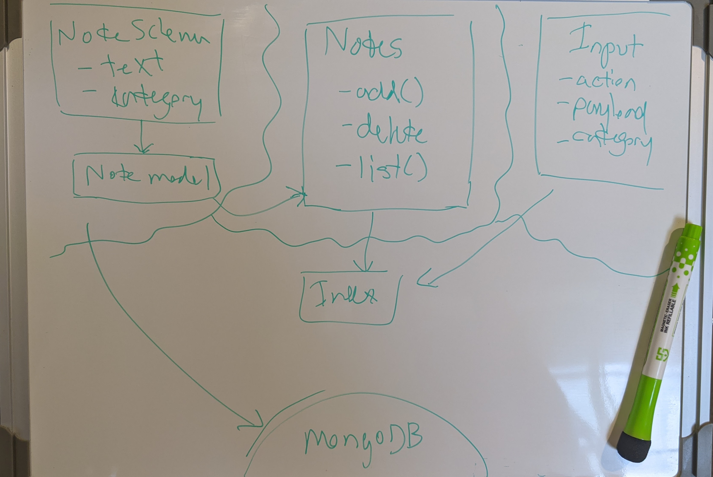
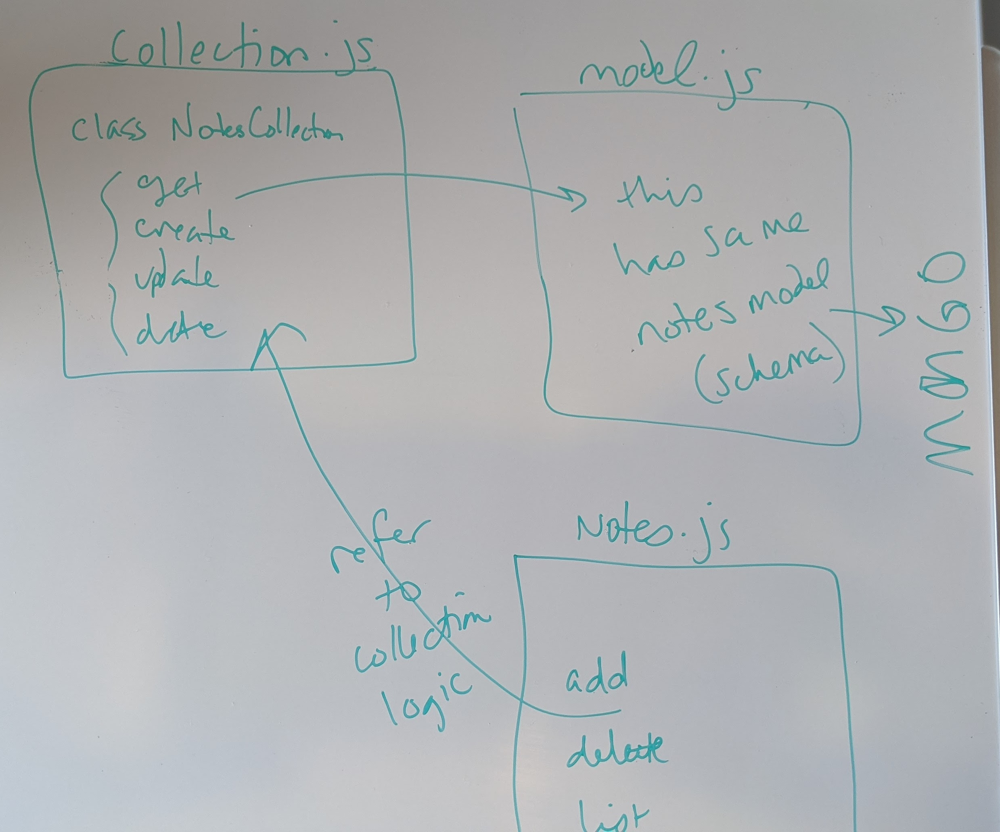

# LAB 01 - 04 | Code Fellows 401

## Project: Notesy

#### Author: Tif Taylor | Date: October 2020

### Links & Resources
- [GitHub Actions Tests Report](https://github.com/401-advanced-javascript-tiftaylor/notes/actions)

### Setup
#### `.env` requirements
- MongoDB URI from Atlas: `MONGODB_URI`

#### `package.json` requirements
- `npm install`
  - [minimist](https://www.npmjs.com/package/minimist)
  - [dotenv](https://www.npmjs.com/package/dotenv)
  - [moongoose](https://www.npmjs.com/package/mongoose)

#### Running the app
- `node index.js --add "Feed dog" --category home`

#### Tests

- Unit Tests: `npm test`

### UML for Lab01 thru Lab 04
**Lab 01**

**Lab 02**

**Lab 03**

**Lab 04**
