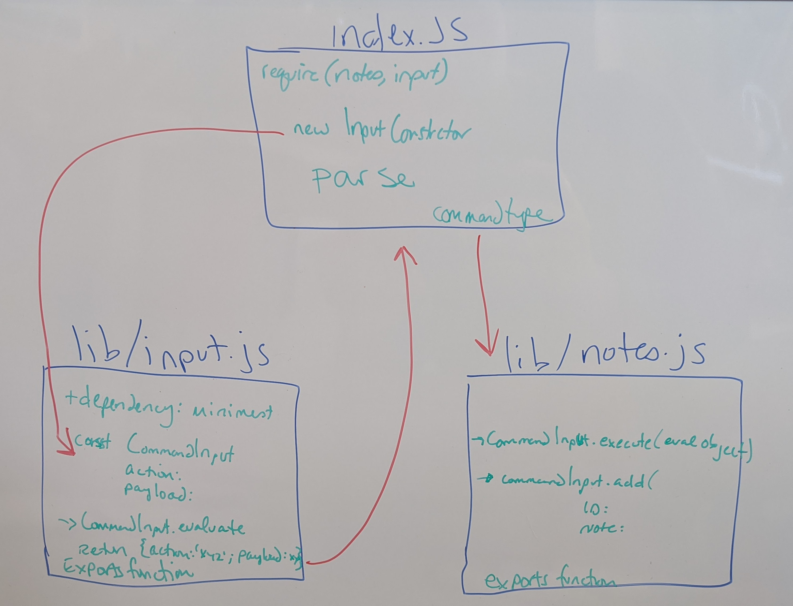
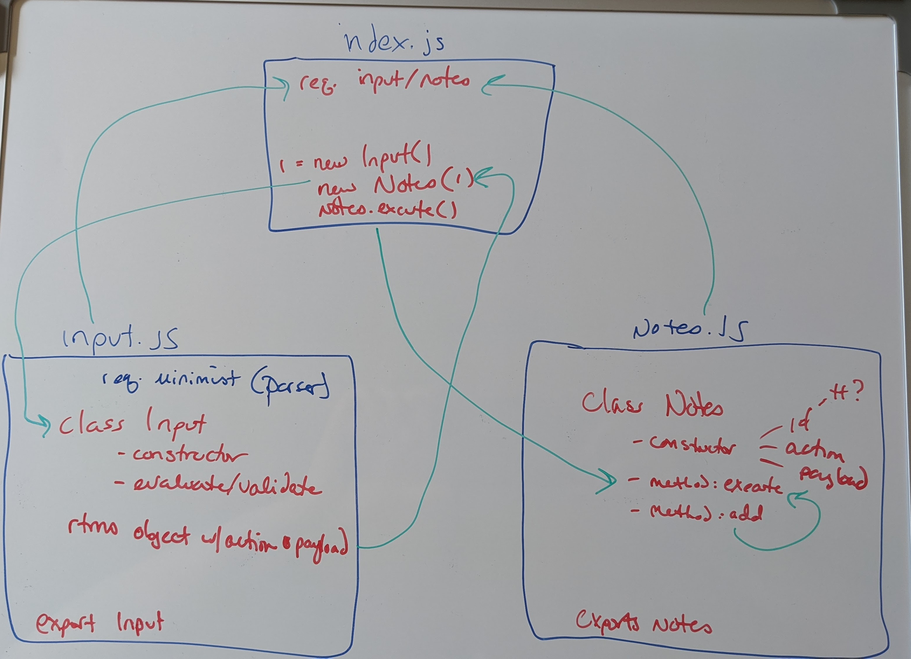

# LAB - 01

## Project: Notes

### Author: Tif Taylor

### Links & Resources
- [tests report](https://github.com/401-advanced-javascript-tiftaylor/notes/actions)

### Setup
#### `.env` requirements
- `PORT` - Port Number
#### `package.json` requirements
- `npm install`
  - [minimist](https://www.npmjs.com/package/minimist)

#### Running the app
- `node index.js --add "Feed dog"`

#### Tests

- Unit Tests: `npm run test`
- Lint Tests: `npm run lint`

#### UML's

